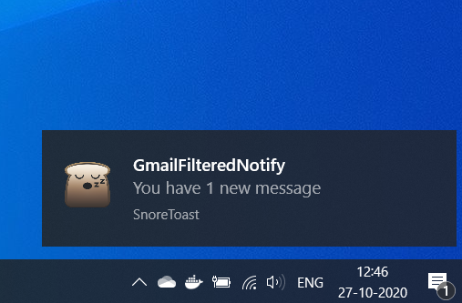
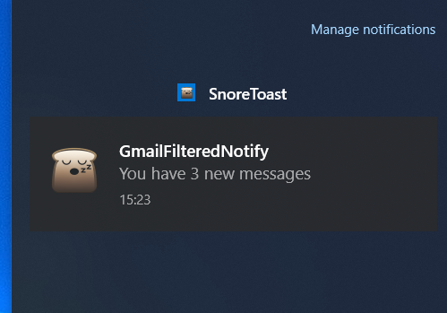
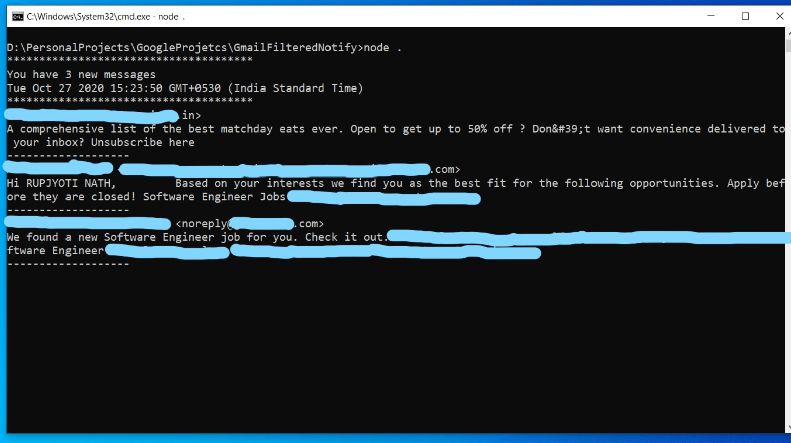

# gmailFilteredNotification

Get Gmail Desktop notifications filtered based on Labels, Email Ids and Company Domain.

Apart from desktop notification, concise detail of the newly received emails appears in console.Here are some notification screenshots.







*In the second screenshot, note the name of the app as SnoreToast, it is because npm package node-notifier uses SnoreToast to send the native notifications. Check the node-notifier package to change the name to your own app name. An app id needs to be provided to fix that.*

## Use Cases
* Applying for jobs and constantly checking emails, better use this application to set domain filter & get notified only on those emails. Study !
* Want to get notified only on some particular emails?

## Filtering

By default, all emails (except CATEGORY_SOCIAL & SPAM messages) will be notified every 15 minutes.

*Note that SPAM messages will never be notified and cannot be controlled using the custom fiter settings.* 

**The file filter.json works as custom filter.**
*Any error in this file will result in falling back to use the default filter included in the app.*

Let's understand how the filter works.

There are three types. In the sequential order of filtering, they are  "labels", "emailIds" & "domains". Each one has "include" and "exclude" list. Apart from that, the email filter has a boolean "domainFilter" & the domain filter has a boolean "socialFilter". *The social filter is for future use and yet to be implemented.*

* Each email will be filtered based on labels. By, labels I mean Gmail labels  like CATEGORY_SOCIAL, CATEGORY_PROMOTION, INBOX, etc.
    * Only one list, either of "include" and "exclude" is checked. Also, include list has higher priority. It means if labels are present in "include" list but some labels are also mentioned in "exclude" list, the exclude list is not even checked. 
    * As the name suggests, if include list is used, if any label in "include" list matches with the newly arrived email labels, this email will be notified. Similarly, any email matching label with "exclude" list , will not be notified.
* After the first level of filtering, it will be filtered based on email Ids provided ("abc@example.com" for example). These are exact email id matches.
    * Similar to label filter, if any emails mentioned in "include" list, only that list will be checked. Therefore, emails matching exactly the email ids will be notified. Any other email will not be notified.
    * If no email id present in "include" list, "exclude" list will be checked. Any email matching with this list will not be notified. All others will be notified.
    * There is also a boolen filter config called domainFilter. This is to check emails that did not match "exclude" list and will be notified but you want further filtering based on a domain. Note that this filter has no meaning if there is any email in "include" list, in that case only "include" list will be checked.
    *Another thing to note is that any email ids mentioned in excluded list will always be blocked irrespective of the domainFilter check.* 
* The final filter is based on domain (example.com for example). Note that only emails that have passed the previous filtering levels will be checked. 
    * Similar to others, if any domain present in "include" list, excludes will not be checked. 

*The filter.json is already ready with default values. Only labels, email ids and domain needs to provided according to the needs. Also, they must be strings inside the predefined array field.*

**Trick:** To get notified only for primary emails (by primary I mean the primary tab in Gmail), provide the CATEGORY_SOCIAL & CATEGORY_PROMOTIONS labels in the "exclude" list in label filter, keeping the "include" list empty. To be honest, the "include" list in label filter is not helpful. Also, avoid providing CATEGORY_UPDATES in "exclude" list as many important emails are marked with this label. 

## Getting Started

Create a project in console.developers.google.com 

Enable the Gmail API and download the client credentials, save as credentials.json file in the project directory.

Visit the Node.js quickstart project for better understanding, [Gmail API Node.js quickstart](https://developers.google.com/gmail/api/quickstart/nodejs)

The application uses OAuth 2.0 for authorization.

Run the app by opening cmd/terminal ```$ node . ``` or ``` $ node index.js ```

The first time it will ask for the authorization. Visit the URL that appears in console after runnign the project. After providing permission, you will be redirected to a localhost page. In the URL , there will be a Authorization code, **code=** . Copy only the value of the code part and paste in console. Do not copy any other parameter value.

The first time app runs, it will sync with Gmail so only emails received after starting up will be notified. *Two filed sync.json & sync-backup.json will be created to keep the latest history id.*

Subsequent running of the project will not ask for authorization.
*Also check the refresh token concept in the googleapis npm package provided in credits section.*

## Push Vs Poll

The application pulls data every 15 minutes. Gmail API also has push based information, but requires a Google Cloud Pub/Sub. Check the documention if push notifications needed.

**Note that for notifications to user-owned devices (i.e. installed apps, mobile devices, or browsers), the poll-based approach is the recommended approach to retrieve updates, as mentioned by Google themselves.**

Check [Receive Push Notifications](https://developers.google.com/gmail/api/guides/push) & [Sync a mail client](https://developers.google.com/gmail/api/guides/sync) for more information. The current application is built using the later approach.

## Credits
* [node-notifier](https://www.npmjs.com/package/node-notifier) Awesome package to send cross platform native notifications using Node.js
* [googleapis](https://www.npmjs.com/package/googleapis) Node.js client library for using Google APIs

## References
* [Gmail API](https://developers.google.com/gmail/api/guides)
* [Gmail API Node.js quickstart](https://developers.google.com/gmail/api/quickstart/nodejs)

## Notes
* Gmail also provides some filtering. Check the settings.
* The applocation just shows a use case on how Google provided API (Gmail API , in particular) can be used. The business logic can vary. Many useful applications can be developed.

## Future Improvements
* Remove the manual entering of Authorization code.
* Implement the social/Linkedin filter.
* Handling of refresh token.
* Improve the console look.
* Provide a way to sync with Gmail manually.

## LICENSE
MIT

Check the license file provided. The npm packages have their respective licenses. 

Also note that some code (the authentication and authorization) is taken from **Google Gmail/Calendar API Node.js quickstart project, the code has Apache 2.0 license. I have mentioned/ attributed Google in the source code.** Any other code is solely written by me. Note that I didn't take code from GitHub, I followed the quickstart provided in References.